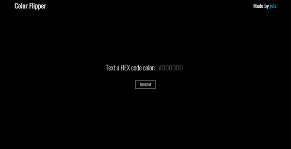

# Color Flipper

## Change the background color with just one click.

[](https://github.com/jvtz/color-flipper/blob/main/LICENSE) [](https://travis-ci.org/joemccann/dillinger)

# About the project

https://jvtz.github.io/color-flipper/

Color Flipper is a responsive website, mobile-ready, build with semantic HTML5, CSS3 and vanilla Javascript.

The application consists in a website that changes the background randomly when the user clicks in a button, or manually when the user write a HEX Code.

## Layout web



# Features

- HTML5
- CSS3
- JavaScript

# Development

Clone locally:

```bash
    $ git clone https://github.com/jvtz/color-flipper
    $ cd color-flipper
    $ yarn install
    $ yarn start
```

# Author

- Made by [jvtz](https://github.com/jvtz)
